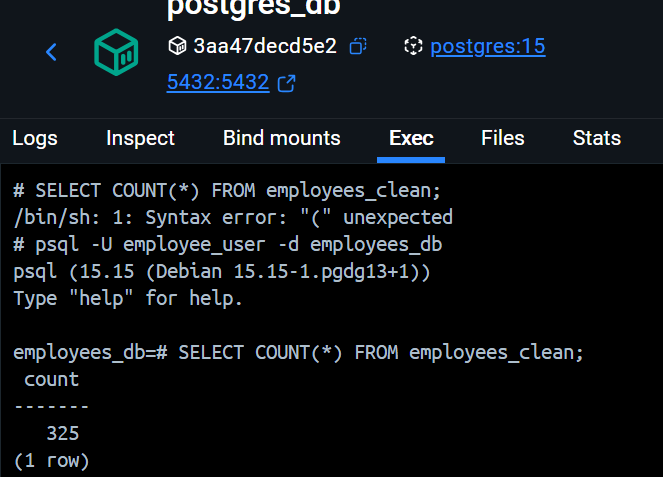
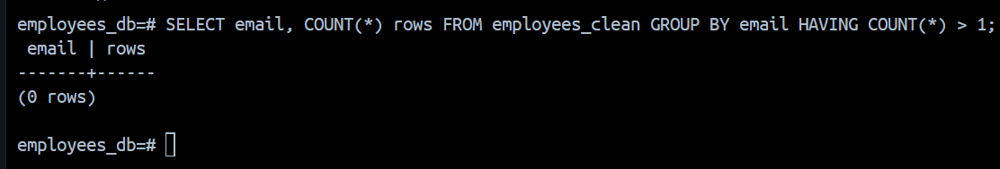
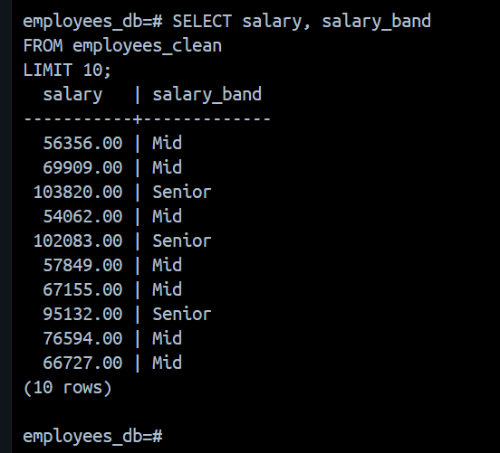
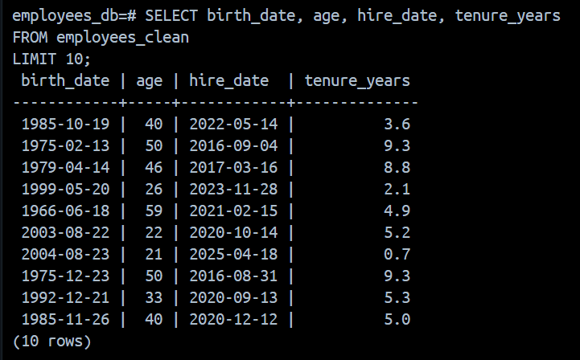

# Employee Data Engineering Pipeline

## Overview
This project implements an **end-to-end data engineering pipeline** that ingests raw employee data from CSV files, performs **data cleaning, validation, transformation, and enrichment using Apache Spark**, and loads the processed data into a **PostgreSQL database**.

The pipeline is fully **Dockerized** and is designed to simulate **real-world data quality issues**, not ideal or perfectly clean datasets.

---

## Architecture

```
Raw CSV (employees_raw.csv)
        ↓
Apache Spark (Cleaning, Validation, Enrichment)
        ↓
PostgreSQL (employees_clean table)
```

### Technology Stack
- Apache Spark (PySpark)
- PostgreSQL
- Docker & Docker Compose
- Python

---

## Project Structure

```
employee-data-pipeline/
├── docker-compose.yml
├── README.md
├── data/
│   └── employees_raw.csv
├── spark/
│   ├── Dockerfile
│   └── employee_cleaning.py
├── postgres/
│   └── init.sql
├── scripts/
│   └── generate_data.py
```

---

## Input Data Description

The raw dataset (`employees_raw.csv`) is **synthetically generated** and intentionally contains data quality issues to validate the pipeline logic.

### Data Issues Introduced
- Duplicate `employee_id`
- Duplicate `email`
- Invalid email formats
- Salary values with `$` and commas
- Future `hire_date`
- Mixed case categorical values
- Missing values in non-critical columns

This reflects **real-world enterprise data**, not sanitized demo data.

---

## Data Cleaning & Transformation Logic

All data transformations are implemented in **Apache Spark**.

### 1. Data Validation Rules

| Rule | Handling |
|------|----------|
| Missing `employee_id`, `email`, `hire_date` | Record dropped |
| Duplicate `employee_id` | Deduplicated |
| Duplicate `email` | Deduplicated to match DB constraint |
| Invalid email format | Dropped |
| Future `hire_date` | Dropped |

---

### 2. Column-Level Transformations

| Column | Transformation |
|--------|----------------|
| `first_name`, `last_name` | Converted to Proper Case |
| `email` | Lowercased |
| `salary` | Removed `$` and `,`, cast to numeric |
| `hire_date`, `birth_date` | Cast to DATE |
| `department`, `status` | Standardized casing |

---

### 3. Derived & Enriched Columns

| Column | Logic |
|--------|-------|
| `full_name` | `first_name + last_name` |
| `email_domain` | Extracted from email |
| `age` | Calculated from `birth_date` |
| `tenure_years` | Calculated from `hire_date` |
| `salary_band` | Junior / Mid / Senior |

---

## Database Design

The cleaned data is stored in PostgreSQL in the `employees_clean` table.

### Key Constraints
- `PRIMARY KEY (employee_id)`
- `UNIQUE (email)`
- Strong typing for numeric and date fields

The database acts as the **final data integrity layer**.

---

## Pipeline Execution

The Spark job runs as a **batch process** inside a Docker container.

### Execution Flow
1. PostgreSQL container starts
2. Schema is initialized using `init.sql`
3. Spark container starts
4. Spark job executes via `spark-submit`
5. Cleaned data is written to PostgreSQL
6. Spark container exits

---

## Output Summary

| Metric | Value |
|--------|-------|
| Raw records | ~1000 |
| Clean records loaded | **325** |
| Duplicate emails | **0** |
| Future hire dates | **0** |

The reduction in record count is expected and confirms that data quality rules are applied correctly.

---

## Data Verification (SQL Queries)

### 1. Sample Record from Clean Table

```sql
SELECT * FROM employees_clean LIMIT 1;
```

**Sample Output:**

| employee_id | first_name | last_name | full_name     | email                     | email_domain | hire_date  | title                          | department | salary   | salary_band | manager_id | address                               | city            | state | zip_code | birth_date | age | tenure_years | status | created_at                  | updated_at                  |
|-------------|------------|-----------|---------------|---------------------------|--------------|------------|--------------------------------|------------|----------|-------------|------------|---------------------------------------|-----------------|-------|----------|------------|-----|--------------|--------|-----------------------------|-----------------------------|
| 1384        | Aaron      | Johnson   | Aaron Johnson | aaron.johnson@company.com | company.com  | 2022-05-14 | Engineer-manufacturing-systems | It         | 56356.00 | Mid         |            | 9426 Roberta SquaresNorth Jane, MH 41087 | South-Kyleburgh | AZ    | 65204    | 1985-10-19 | 40  | 3.6          | Active | 2026-01-18 10:58:53.889967  | 2026-01-18 10:58:53.889967  |

This demonstrates:
- **Proper case names** (Aaron Johnson)
- **Lowercase email** (aaron.johnson@company.com)
- **Extracted email domain** (company.com)
- **Clean salary** (56356.00 - no $ or commas)
- **Calculated age** (40 years from birth_date)
- **Calculated tenure** (3.6 years from hire_date)
- **Salary band assignment** (Mid based on salary range)
- **Timestamps** for audit trail

---

### 2. Total Record Count

```sql
SELECT COUNT(*) FROM employees_clean;
```



### 3. Email Uniqueness Validation

```sql
SELECT email, COUNT(*)
FROM employees_clean
GROUP BY email
HAVING COUNT(*) > 1;
```



### 4. Salary Cleaning & Band Validation

```sql
SELECT salary, salary_band
FROM employees_clean
LIMIT 10;
```



### 5. Age & Tenure Validation

```sql
SELECT birth_date, age, hire_date, tenure_years
FROM employees_clean
LIMIT 10; 
```

